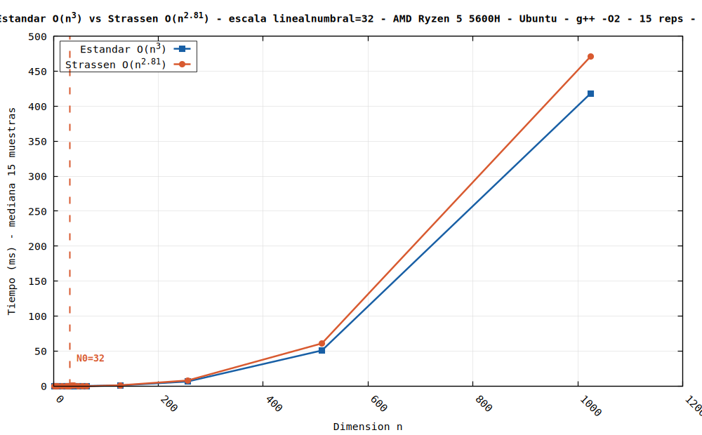
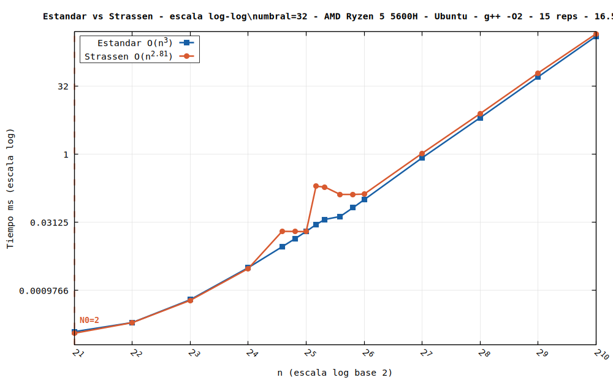

# Análisis Empírico: Strassen vs. Multiplicación Estándar de Matrices

Experimento controlado para determinar empíricamente el valor crítico **N₀** a partir del cual el algoritmo de Strassen (O(n^2.81)) supera en tiempo de ejecución al algoritmo estándar (O(n³)), contrastando la predicción teórica del MIT (~n=32) con resultados reales sobre hardware moderno.

---

## Resultados

| Métrica | Valor |
|---|---|
| N₀ detectado empíricamente | **n = 32** |
| Tiempo estándar en N₀ | 0.0327 ms |
| Tiempo Strassen en N₀ | 0.0294 ms |
| Rango evaluado | n = 2 … 1024 |
| Repeticiones por tamaño | 15 (+ 1 warmup descartado) |
| Estadístico principal | Mediana |

> El cruce en n=32 es el único observado en el rango evaluado. A partir de n=36 el padding obligatorio a potencias de 2 penaliza severamente a Strassen (hasta 7× más lento que el estándar).

---

## Entorno de Ejecución

| Componente | Detalle |
|---|---|
| Procesador | AMD Ryzen 5 5600H (6 núcleos, 12 hilos) |
| Memoria RAM | 16 GB DDR4 |
| Sistema Operativo | Ubuntu 22.04 LTS |
| Compilador | g++ (GCC) 11.4.0 |
| Flags | `-O2 -std=c++17` |
| Graficación | gnuplot |

---

## Estructura del Repositorio

```
.
├── main.cpp          # benchmark, medición y generación de gráficos
├── matriz.cpp        # implementaciones: estándar, Strassen, utilidades
├── matriz.h          # declaraciones
├── Makefile          # compilación y ejecución
├── data/             # carpeta generada al ejecutar el codigo
│   ├── tiempos.csv   # mediciones crudas (todas las repeticiones)
│   └── medianas.csv  # resumen por n (usado por gnuplot)
└── figures/
    ├── comparacion_lineal.png
    └── comparacion_loglog.png
```

---

## Cómo Reproducir

**Requisitos:** `g++` con soporte C++17 y `gnuplot`.

```bash
# Ubuntu / Debian
sudo apt install g++ gnuplot

# Clonar y ejecutar
git clone https://github.com/XXGianX/analisis-empirico-matrices.git
cd analisis-empirico-matrices
make run
```

El programa compila, valida la correctitud de Strassen, ejecuta el benchmark completo y genera los gráficos automáticamente en `figures/`.

---

## Metodología

**Tamaños evaluados:** `{2, 4, 8, 16, 24, 28, 32, 36, 40, 48, 56, 64, 128, 256, 512, 1024}`
— con muestreo denso alrededor de n=32 para capturar el cruce con precisión.

**Control de ruido:**
- Warmup previo a cada tamaño (descartado) para estabilizar caché y branch predictor.
- 15 repeticiones por tamaño; se reporta la **mediana** para mitigar picos del SO.
- Semillas fijas por repetición (`mt19937`) — ambos algoritmos operan sobre las mismas matrices exactas.

**Implementación de Strassen:**
- Caso base híbrido: por debajo del umbral (`UMBRAL = 32`) se delega al algoritmo estándar.
- Padding automático a la siguiente potencia de 2 cuando n no lo es.
- Validación de correctitud antes del benchmark (n = 4, 8, 16, 32).

**Orden de loops en el estándar:** `i-k-j` en vez del intuitivo `i-j-k` — mantiene `B[k][j]` contiguo en memoria, reduciendo cache misses significativamente.

---

## Gráficos

**Escala lineal** — permite ver el cruce en N₀:



**Escala log-log** — permite comparar las pendientes asintóticas:



---

## Conclusiones

El experimento confirma N₀ ≈ 32, coincidiendo con la predicción del MIT/CLRS. Sin embargo, el cruce es puntual y marginal (diferencia de 0.0033 ms): el overhead de alocación dinámica con `std::vector` y el padding a potencias de 2 devuelven la ventaja al estándar en todo el rango restante evaluado.

Esto demuestra que **N₀ no es una constante universal** — depende fuertemente del lenguaje, compilador, estructura de datos y jerarquía de memoria. En la práctica, implementaciones eficientes de Strassen utilizan esquemas híbridos con umbral entre 64 y 128 y gestión manual de memoria para evitar el overhead de alocación.

---

## Autor

**GianX** — Algoritmos y Complejidad
